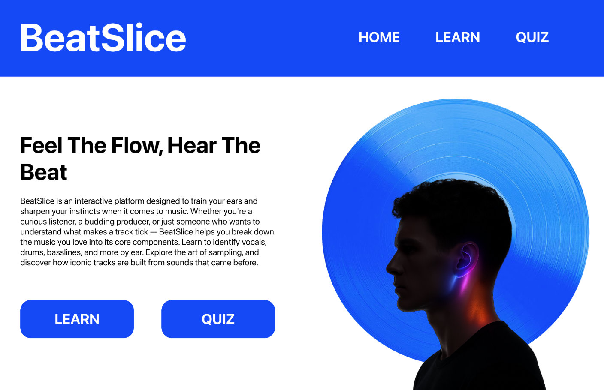

# BeatSlice

Welcome to the **Hip-Hop Sampling Interactive Guide**, a learning experience designed to help users understand the creative process behind sampling in hip-hop music. From iconic flips to audio quizzes, this platform offers both education and entertainment through music.

---

## 🛠 Project Description

**BeatSlice** is an interactive platform designed to train your ears and sharpen your instincts when it comes to music. Whether you're a curious listener, a budding producer, or just someone who wants to understand what makes a track tick — BeatSlice helps you break down the music you love into its core components.

Learn to identify vocals, drums, basslines, and more by ear. Explore the art of sampling, and discover how iconic tracks are built from sounds that came before.

---

## 🎯 Iteration Focus

### Prototype to Iterate:
- **Hip-Hop Sampling Interactive Guide** (only one prototype in use)

### Key Focus:
- **Clarify the user flow and interaction structure**

### Why?
Right now, there’s a risk of users getting confused if they don’t know what to listen for or how to compare the sample vs. final version. Improving sequencing and instructions will help users like *Crystal* stay engaged and focused.

---

## 📌 Feedback Summary

- **Positive:** Encouraged to implement a hi-fi version.
- **Negative:** None so far.

---

## 🔁 Next Steps

- Refine sequencing of:
  - Audio clips (sample → flip)
  - Visual overlays
  - Interactive quizzes

- Add clearer prompts or guided instructions for users to follow along.

---

## 🧪 Components

- **Media:**
  - Side-by-side audio comparisons of samples and flipped tracks
  - Waveform diagrams and interactive visuals

- **Quizzes:**
  - Drag-and-drop: Match the sample to the hip-hop track
  - Audio ID: Identify sampled elements like drums, strings, or vocals

---

## 💡 Goal

To create a smooth, educational, and engaging tool for learning about hip-hop sampling techniques, improving listening skills, and deepening appreciation for the genre.

---